<div align=center>

|    NRP     |      Name                     |
| :--------: | :---------------------------: |
| 5025221216 | Muhammad Gesang Ridho Widigdo |

</div>

## Minggu 1

### 1. Halaman Awal dan Membuat Halaman

Dalam laravel, saat kita membuat project baru kemudian menjalankannya di browser, maka akan muncul tampilan awal dari laravel seperti berikut.

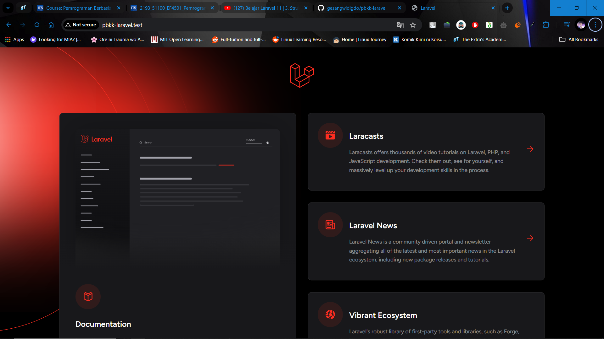

Dapat dilihat dari address bar tersebut, nama project yang dibuat adalah pbkk-laravel dan dengan mengakses url (/), maka halaman awal dari project tersebut akan ditampilkan, yang mana merupakan tampilan bawaan dari laravel. Hal ini dapat dilihat di direktori ```routes/web.php```. File ini berfungsi untuk melakukan routing terhadap tampilan atau data mana yang akan ditampilkan saat user melakukan request.

```php
<?php

use Illuminate\Support\Facades\Route;

Route::get('/', function () {
    return view('welcome');
});
```

Dari gambar di atas, diketahui jika saat root url diakses, atau dalam kasus ini kita mengakses ```/```, maka program akan menampilkan halaman welcome. Halaman tersebut tersimpan di direktori```./resources/views/```. Halaman tersebut dibuat menggunakan blade, template engine bawaan Laravel.

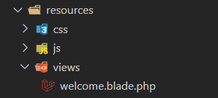

Untuk membuat halaman baru pada Laravel, dapat dilakukan dengan menuliskan kode berikut ke dalam ```routes/web.php``` dan menentukan URL dan halaman mana yang akan ditampilkan dengan fungsi ```view()```. Misal kita akan membuat halaman about, maka tulis kode program seperti di bawah.

```php
Route::get('/about', function () {
    return view('about');
});
```

Setelah itu, buat view baru di ```resources/views/```. Karena kode di atas me-return ```view('about')```, maka file harus dinamai ```about.blade.php```.

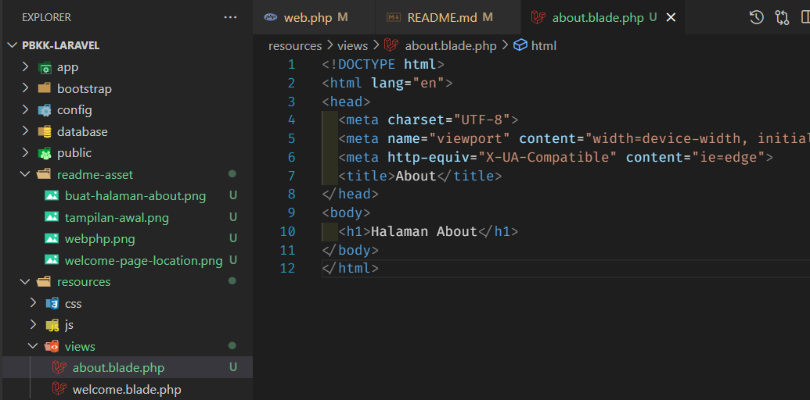

Untuk mengetahui apakah view berhasil dibuat, akses ```pbkk-laravel.test/about``` untuk melihat halaman /about.

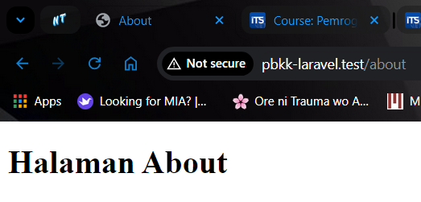

Hal yang sama dapat dilakukan saat kita ingin mengubah tampilan awal, atau saat root url diakses. Kita tinggal mengubah view yang akan direturn saat root url diakses, dan membuat file blade baru.

```php
Route::get('/', function () {
    return view('home');
});
```

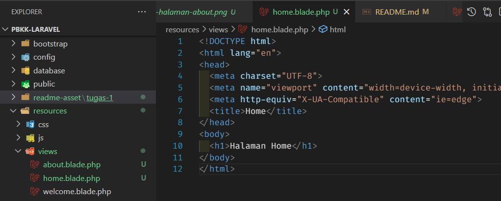

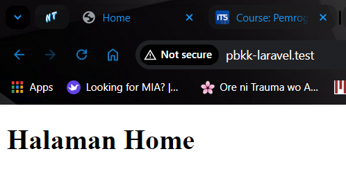

Dapat dilihat saat kita mengakses root url, yang mana sebelumnya akan menampilkan tampilan bawaan laravel, sekarang hanya akan menampilkan halaman yang baru kita buat.

**Menambahkan Style**

Untuk menambahkan asset pada blade, dapat dengan menyimpan file ```.css``` pada direktori ```public/```.

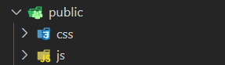

### 2. Mengirim Data ke View

Kita juga dapat mengirimkan data yang berada di web.php ke halaman view.

web.php

```php
Route::get('/about', function () {
    return view('about',[
        'title' => 'About',
        'nama' => 'Gesang'
    ]);
});

Route::get('/blog', function () {
    return view('blog',[
        'title' => 'Blog',
    ]);
});

Route::get('/contact', function () {
    return view('contact',[
        'title' => 'Contact',
    ]);
});
```

Kemudian menampilkan datanya dengan cara berikut

  ```php
  <h2>Nama: {{ $nama }}</h2>
  ```

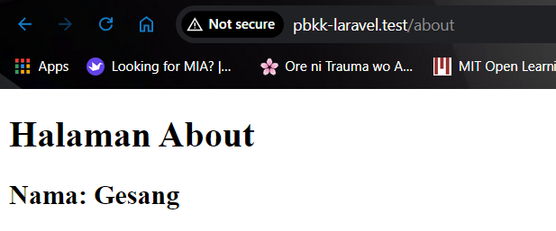

### 3. Menggunakan Template dari Tailwind

Untuk menggunakan tailwind pada laravel, kita perlu menginstallnya terlebih dahulu. Untuk dokumentasi instalasinya dapat dilihat di halaman [dokumentasi tailwind](https://tailwindui.com/documentation) atau di [intalasi tailwind di laravel](https://tailwindcss.com/docs/guides/laravel). Untuk template yang akan digunakan adalah template **Stacked Layout** berikut.

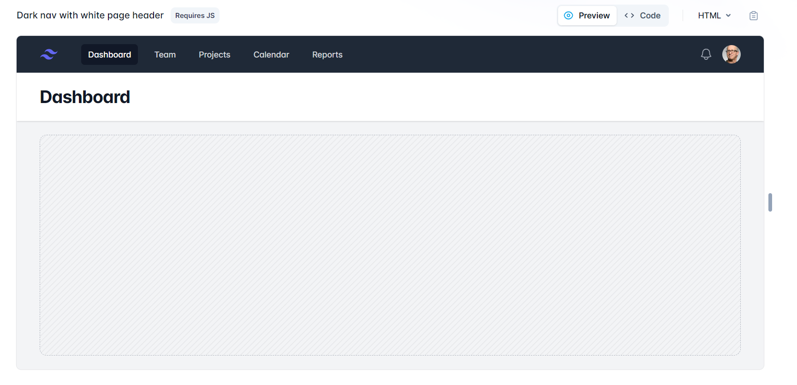

Copy template tersebut ke file blade, dan lakukan konfigurasi berdasarkan dokumentasi [ini](https://tailwindui.com/documentation#using-html-and-your-own-js) dan *comment* yang ada di dalam template. Setelah melakukan konfigurasi, tampilan website akan menjadi seperti di bawah.

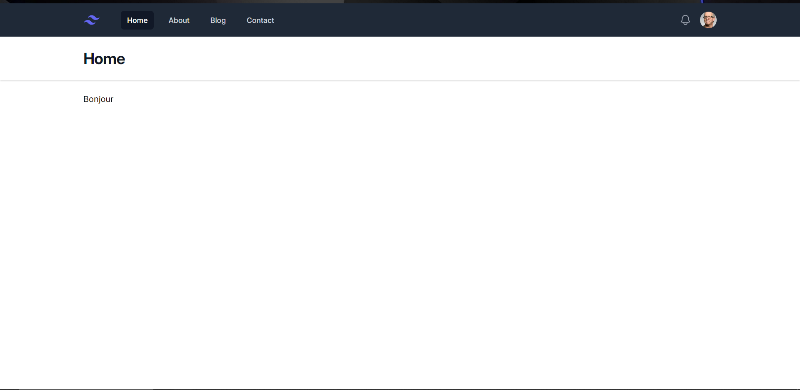

### 4. Menggunakan Blade Component

Blade component merupakan fitur pada Laravel untuk membuat suatu component yang dapat digunakan berulang-ulang pada blade. Component ini berguna untuk mengurangi repetisi jika sebuah halaman memerlukan tampilan yang sama atau mirip dengan tampilan di halaman lainnya atau terjadi perubahan pada component tersebut. Contoh component yang dapat dibuat adalah Navbar component, karena component ini digunakan di banyak halaman seperti home, about, blog, dan contact.

Untuk membuat component, dapat dengan menggunakan perintah berikut (nama component biasanya diawali dengan huruf kapital).

```
php artisan make:component <NamaComponent>
```

Misal kita membuat component baru dengan nama Navbar. Setelah perintah tersebut dijalankan, akan muncul 2 file baru, yaitu ```navbar.blade.php``` di folder ```./resources/views/components/``` dan ```Navbar.php``` di direktori ```./app/View/Components/```. Namun yang akan paling banyak diubah adalah yang ada di dalam folder ```./resources```. Jika kita tidak ingin membuat file di dalam folder ```./app```, maka kita tinggal menambahkan flag ```--view``` di akhir.

```
php artisan make:component <NamaComponent> --view
```

Setelah component berhasil dibuat, copy semua yang ada di dalam tag ```<nav>``` ke dalam ```navbar.blade.php```.

```php
<nav class="bg-gray-800" x-data="{ isOpen: false }">
    <div class="mx-auto max-w-7xl px-4 sm:px-6 lg:px-8">
        ...
    </div>

    <!-- Mobile menu, show/hide based on menu state. -->
    <div x-show="isOpen" class="md:hidden" id="mobile-menu">
        ...
    </div>
</nav>
```

Kemudian untuk menggunakan component tersebut, dapat dipanggil dengan menggunakan tag ```<x-nama-component>```

```home.blade.php```

```php
<div class="min-h-full">
  <x-navbar></x-navbar>
  <header class="bg-white shadow">
    <div class="mx-auto max-w-7xl px-4 py-6 sm:px-6 lg:px-8">
      <h1 class="text-3xl font-bold tracking-tight text-gray-900">{{ $title }}</h1>
    </div>
  </header>
  <main>
    <div class="mx-auto max-w-7xl px-4 py-6 sm:px-6 lg:px-8">
      <!-- Your content -->
      <p>Bonjour</p>
    </div>
  </main>
</div>
```

Setelah itu, dibuat juga component untuk header. Namun karena judul di tiap halaman berbeda, misal di halaman Home, maka headernya harus menampilkan teks "Halaman Home". Untuk mengatasi permasalahan tersebut, kita dapat menambahkan ```{{ $slot }}``` di component header. Isi dari $slot ini nantinya akan mengambil apapun yang berada di antara tag ```<x-header>```.

```header.blade.php```

```php
<header class="bg-white shadow">
    <div class="mx-auto max-w-7xl px-4 py-6 sm:px-6 lg:px-8">
        <h1 class="text-3xl font-bold tracking-tight text-gray-900">{{ $slot }}</h1>
    </div>
</header>
```

Contoh penggunaan

```php
<x-header>Halaman Home</x-header>
```

Maka hasilnya akan jadi seperti ini.

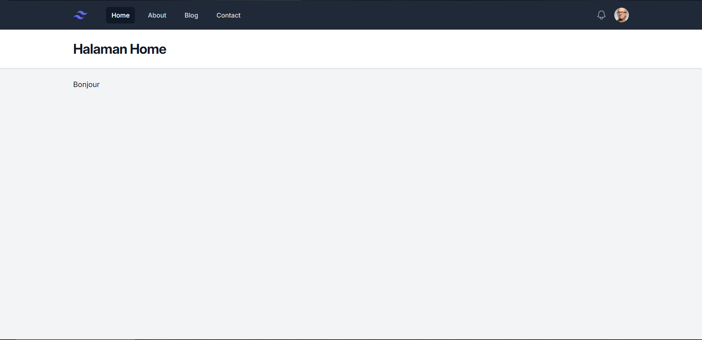

### 5. Membuat Layout

Agar template Tailwind yang kita pasang sebelumnya dapat bekerja di halaman lain, kita perlu membuat layout. Ada 2 cara untuk membuatnya, yaitu dengan menggunakan Component seperti sebelumnya, atau dengan menggunakan *Template Inheritance*. Namun dalam kasus ini kita menggunakan Component.

Dimulai dengan membuat component baru dengan nama Layout, kemudian copy semua kode tempat template tailwind digunakan ke dalam component Layout. Setelah itu isi konten dari layout tersebut diisi dengan ```$slot```, karena selain header, yang membedakan antara halaman satu dengan halaman lainnya adalah isi atau konten dari halaman tersebut.

```layout.blade.php```

```php
<!DOCTYPE html>
<html lang="en" class="h-full bg-gray-100">
<head>
    ...
</head>
<body class="h-full">
    <!--
    This example requires updating your template:

    ```
    <html class="h-full bg-gray-100">
    <body class="h-full">
    ```
    -->
    <div class="min-h-full">
    <x-navbar></x-navbar>

    <x-header>Halaman Home</x-header>

    <main>
        <div class="mx-auto max-w-7xl px-4 py-6 sm:px-6 lg:px-8">
        <!-- Your content -->
        {{ $slot }}
        </div>
    </main>
    </div>

</body>
</html>
```

```home.blade.php```

```php
<x-layout>
  <h3 class="text-xl">Ini adalah halaman Home Page</h3>
</x-layout>
```

Tampilan pada website

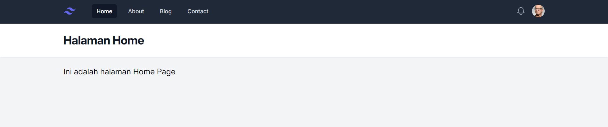

Dapat dilihat pada bagian ```<x-header>``` isinya masih dideklarasikan secara manual. Namun tidak semua halaman headernya berupa teks "Halaman Home". Maka dari itu, program perlu mengirimkan data dari routes ke layout. Caranya adalah dengan menggunakan ```<x-slot:key-data>```. Sehingga untuk mengirimkan title, akan menjadi ```<x-slot:title>```.

```web.php```

```php
Route::get('/', function () {
    return view('home', [
        'title' => 'Home'
    ]);
});
```

```home.blade.php```

```php
<x-layout>
  <x-slot:title>{{ $title }}</x-slot:title>
  <h3 class="text-xl">Ini adalah halaman Home Page</h3>
</x-layout>
```

Sehingga tampilan dari halaman Home, About, Blog, dan Contact dapat berubah-ubah sesuai dengan data yang dikirimkan.

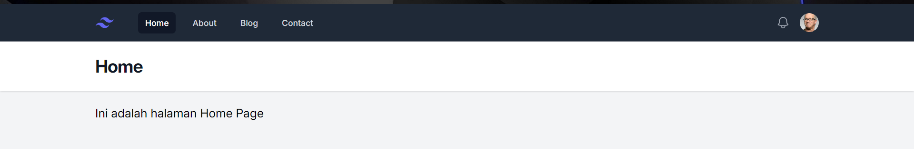

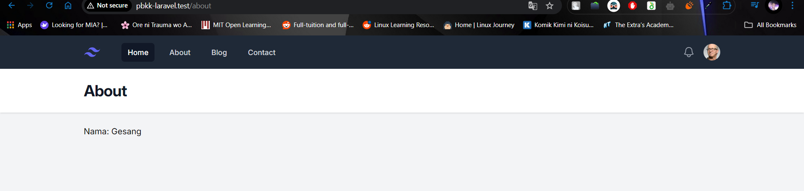

Saat ini pada navbar hanya halaman Home saja yang memiliki status *active* saat halaman tersebut dibuka. Namun saat kita berpindah ke halaman lain seperti About, yang *active* di navbar masih tetap Home. Maka dibuat component baru untuk nav-link.

```nav-link.blade.php```

```php
<a {{ $attributes }} class="{{ $active ? 'bg-gray-900 text-white' : 'text-gray-300 hover:bg-gray-700 hover:text-white' }} rounded-md px-3 py-2 text-sm font-medium text-white" aria-current="{{ $active ? 'page' : false }}">{{ $slot }}</a>
```

```navbar.blade.php```

```php
<x-nav-link href="/" :active="request()->is('/')">Home</x-nav-link>
<x-nav-link href="/about" :active="request()->is('about')">About</x-nav-link>
<x-nav-link href="/blog" :active="request()->is('blog')">Blog</x-nav-link>
<x-nav-link href="/contact" :active="request()->is('contact')">Contact</x-nav-link>
```


Pada component di atas, {{ $attributes }} akan mengambil atribut yang ada saat komponen tersebut digunakan. Kemudian pada ```navbar.blade.php```, terdapat ```:active="request()->is('/')"``` yang akan mengecek apakah saat ini halaman yang aktif merupakan /, /about, /blog, atau /contact. Data yang dikirimkan berupa boolean dan akan dilakukan pengecekan di nav-link.

Tampilan dari perubahan di atas apat dilihat saat kita mengakses halaman lain.

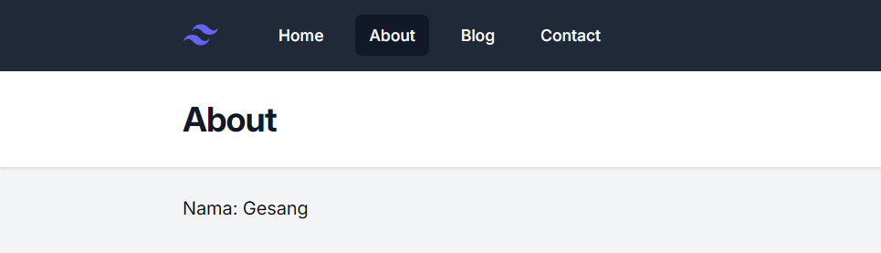

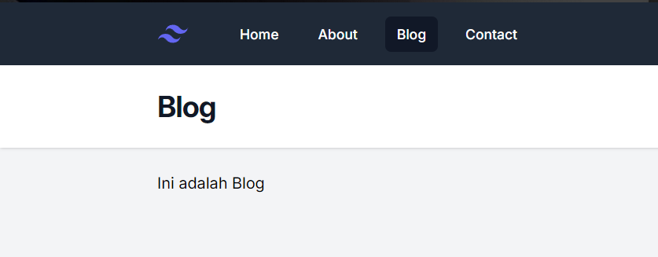

## Minggu 2

1. Perubahan pada video [6. View Data](https://www.youtube.com/watch?v=76YsC4EjGE4&list=PLFIM0718LjIW1Xb7cVj7LdAr32ATDQMdr&index=6&ab_channel=WebProgrammingUNPAS)

    - Menambahkan ```@props``` untuk menyembunyikan atribut ```active``` saat console dibuka
    
        ```php
        @props(['active' => false])

        <a {{ $attributes }} class="{{ $active ? 'bg-gray-900 text-white' : 'text-gray-300 hover:bg-gray-700 hover:text-white' }} rounded-md px-3 py-2 text-sm font-medium text-white" aria-current="{{ $active ? 'page' : false }}">
        {{ $slot }}
        </a>
        ```

    - Rename `blog.blade.php` menjadi `posts.blade.php`

    - Update data artikel di routes `/posts` dan membuat rute baru untuk melihat detail artikel dengan rute `/posts/{slug}`

        ```php
        Route::get('/posts', function () {
            return view('posts',[
                'title' => 'Blog',
                'posts' => [
                    [
                        'id' => 1,
                        'slug' => 'judul-artikel-1',
                        'title' => 'Judul Artikel 1',
                        'author' => 'Gesang Widigdo',
                        'body' => 'Lorem ipsum dolor sit amet consectetur adipisicing elit. Illo sapiente exercitationem enim facilis delectus inventore amet neque eaque, nostrum, sunt quod! Est laboriosam consequatur tenetur fuga fugit magnam maxime neque voluptatum eum cum aliquid, quia, id molestiae saepe aspernatur ullam eius, quos odio exercitationem nulla harum. Voluptates sequi exercitationem fugiat voluptatum aspernatur iusto facere aperiam dolor, suscipit assumenda, reprehenderit, repellendus modi quis asperiores. Ipsam officiis, quidem quae sint, libero adipisci cum laborum voluptate quos, quis consectetur eligendi ullam enim ex ipsa similique nemo ut vel at esse eum veritatis provident. Corporis consequuntur deserunt voluptatum delectus veniam dolore possimus aliquid voluptas.',
                    ],
                    ...
                ]
            ]);
        });

        Route::get('/posts/{slug}', function($slug) {
            $posts = [...]
        });
        ```

    - Memanfaatkan `foreach()` di `posts.blade.php` untuk melakukan perulangan dalam menampilkan data di route `/posts` dan memberikan limit jumlah karakter di artikel body yang ditampilkan menggunakan `Str::limit()`

        ```php
        <x-layout>
            <x-slot:title>{{ $title }}</x-slot:title>

            @foreach ($posts as $post)
            <article class="py-8 max-w-screen-md border-b border-gray-300">
                <a href="/posts/{{ $post['slug'] }}"><h2 class="mb-1 text-3xl tracking-tight font-bold text-gray-950 hover:underline">{{ $post['title'] }}</h2></a>
                <div class="text-base text-gray-500">
                    <a href="#">{{ $post['author'] }}</a> | 18 September 2024
                </div>

                <p class="my-4 font-light">
                    {{ Str::limit($post['body'], 100) }}
                </p>
                <a href="/posts/{{ $post['slug'] }}" class="font-medium text-blue-500 hover:underline">Read more &raquo;</a>
            </article>
            @endforeach
        </x-layout>
        ```
    
    - Membuat halaman untuk menampilkan isi artikel di `post.blade.php`

        ```php
        <x-layout>
            <x-slot:title>{{ $title }}</x-slot:title>

            <article class="py-8 max-w-screen-md">
                <h2 class="mb-1 text-3xl tracking-tight font-bold text-gray-950 hover:underline">{{ $post['title'] }}</h2>
                <div class="text-base text-gray-500">
                    <a href="#">{{ $post['author'] }}</a> | 18 September 2024
                </div>

                <p class="my-4 font-light">
                    {{ $post['body'] }}
                </p>
                <a href="/posts" class="font-medium text-blue-500 hover:underline">&laquo; Back to post</a>
            </article>
        </x-layout>
        ```
    
    Hasil

    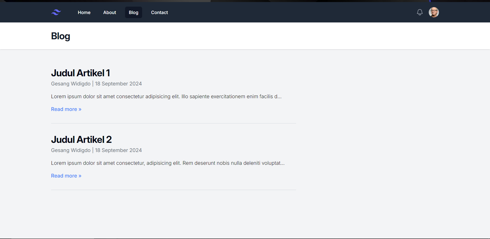

    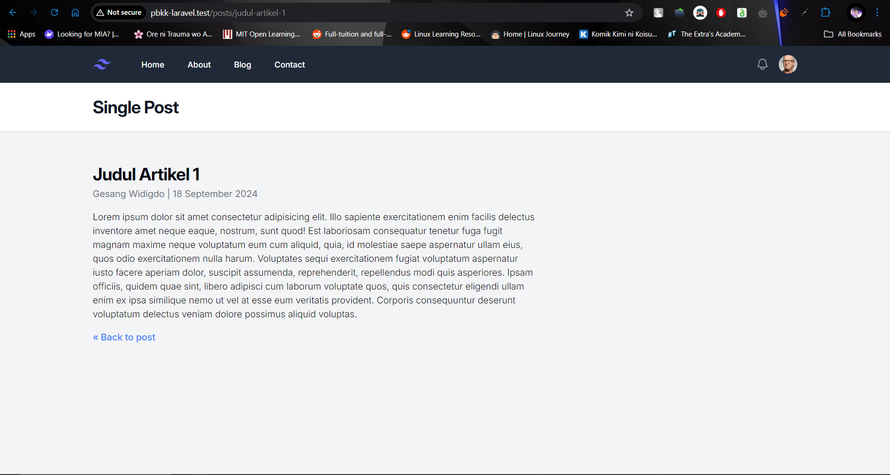

<br>

2. Perubahan pada [Video 7. Model](https://www.youtube.com/watch?v=dzjBbvKjbaQ&list=PLFIM0718LjIW1Xb7cVj7LdAr32ATDQMdr&index=7&ab_channel=WebProgrammingUNPAS)

    - Memindahkan data `$post` dari `web.php` ke model baru dengan nama `Post.php`. Ditambahkan juga `abort(404)` untuk kasus saat terdapat request ke rute yang tidak diketahui.

        `web.php`
        
        ```php
        use App\Models\Post;
        ...

        Route::get('/posts', function () {
            return view('posts',[
                'title' => 'Blog',
                'posts' => Post::all(),
            ]);
        });

        Route::get('/posts/{slug}', function($slug) {
            $post = Post::find($slug);

            return view('post', [
                'title' => 'Single Post',
                'post' => $post,
            ]);
        });

        ...
        ```

        `Post.php`

        ```php
        <?php 

        namespace App\Models;

        use Illuminate\Support\Arr;

        class Post {
            public static function all() {
                return [
                    [
                        'id' => 1,
                        'slug' => 'judul-artikel-1',
                        'title' => 'Judul Artikel 1',
                        'author' => 'Gesang Widigdo',
                        'body' => 'Lorem ipsum dolor sit amet consectetur adipisicing elit. Illo sapiente exercitationem enim facilis delectus inventore amet neque eaque, nostrum, sunt quod! Est laboriosam consequatur tenetur fuga fugit magnam maxime neque voluptatum eum cum aliquid, quia, id molestiae saepe aspernatur ullam eius, quos odio exercitationem nulla harum. Voluptates sequi exercitationem fugiat voluptatum aspernatur iusto facere aperiam dolor, suscipit assumenda, reprehenderit, repellendus modi quis asperiores. Ipsam officiis, quidem quae sint, libero adipisci cum laborum voluptate quos, quis consectetur eligendi ullam enim ex ipsa similique nemo ut vel at esse eum veritatis provident. Corporis consequuntur deserunt voluptatum delectus veniam dolore possimus aliquid voluptas.',
                    ],
                    [
                        'id' => 2,
                        'slug' => 'judul-artikel-2',
                        'title' => 'Judul Artikel 2',
                        'author' => 'Gesang Widigdo',
                        'body' => 'Lorem ipsum dolor sit amet consectetur, adipisicing elit. Rem deserunt nobis nulla deleniti voluptatum. Expedita magni a, ipsum fuga sequi eaque maiores vitae libero. Dicta sapiente ullam nisi quasi labore tempora voluptas quo quibusdam earum porro? Ex velit doloremque qui incidunt deleniti ullam obcaecati neque dolorem repellendus fugiat voluptates in illo odit suscipit vitae minima aperiam, officia magni, accusantium dolor! A molestiae ex deleniti. Beatae nisi quia, asperiores nesciunt temporibus recusandae. Odit aliquam, sequi cupiditate temporibus ea earum tempore ullam illo aut laudantium repudiandae fuga quia architecto, nobis odio iusto numquam accusantium id accusamus voluptatum quisquam! Ipsam, saepe omnis.',
                    ],
                ];
            }

            public static function find($slug): array {
                $post = Arr::first(static::all(), fn ($post) => $post['slug'] == $slug);

                if (!$post) {
                    abort(404);
                } 
                
                return $post;
            }
        }
        ```

        Saat mengakses rute yang tidak diketahui (misal /posts/judul-artikel-3) maka akan diarahkan ke halaman 404.

        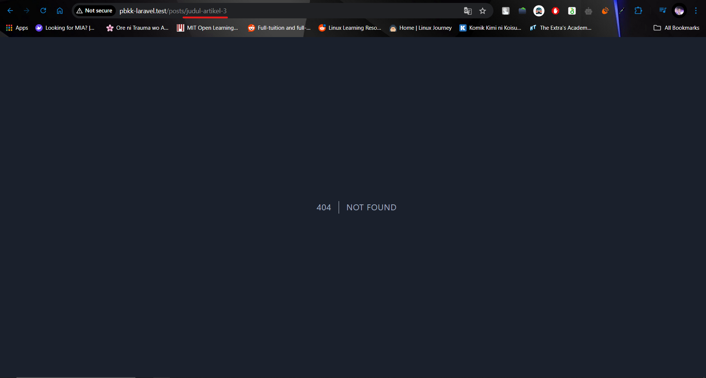

## Minggu 3

1. Perubahan pada video [8. Database & Migration](https://www.youtube.com/watch?v=eghZY9-3Wko&list=PLFIM0718LjIW1Xb7cVj7LdAr32ATDQMdr&index=8&ab_channel=WebProgrammingUNPAS)

    - Membuat database SQLite dengan TablePlus dan melakukan migrasi

        

    - Membuat database MySQL dengan TablePlus dan melakukan migrasi (Hanya sebagai tambahan saja. Database yang digunakan tetap SQLite)

        

    - Membuat file migration untuk tabel posts dengan skema berikut
    
        ```php
        Schema::create('posts', function (Blueprint $table) {
                $table->id();
                $table->string('title');
                $table->string('slug')->unique();
                $table->string('author');
                $table->text('body');
                $table->timestamps();
            });
        ```

    - Menambahkan data ke dalam tabel `posts` yang telah dibuat sebelumnya

        

2. Perubahan pada video [9. Eloquent ORM & Post Model](https://www.youtube.com/watch?v=dW3-33iMYkk&list=PLFIM0718LjIW1Xb7cVj7LdAr32ATDQMdr&index=9&ab_channel=WebProgrammingUNPAS)

    - Mengupdate model `Post` agar terhubung ke tabel `posts` dengan menambahkan keyword `extends Model`

        ```php
        use Illuminate\Database\Eloquent\Model;
        use Illuminate\Support\Arr;

        class Post extends Model {
            protected $table = 'posts';
            protected $primaryKey = 'id';
            protected $fillable = [
                'title', 'slug', 'author', 'body'
            ];
        }
        ```

    - Memanfaatkan **Route Model Binding** untuk mendapatkan data sesuai field yang ditentukan pada route

        ```php
        Route::get('/posts/{post:slug}', function(Post $post) {
            return view('post', [
                'title' => 'Single Post',
                'post' => $post,
            ]);
        });
        ```

        Pada kode di atas, dicari data yang memiliki slug sesuai yang diminta oleh user

    - Melakukan simulasi insert data ke Model menggunakan tinker dengan perintah `php artisan tinker`

        

        Dapat dilihat dari gambar di atas bahwa field `created_at` dan `updated_at` terisi secara otomatis
    
    - Menampilkan tanggal berdasarkan `created_at` dan menampilkannya berdasarkan format tanggal bulan tahun.

        ```php
        <a href="#">{{ $post['author'] }}</a> | {{ $post->created_at->format('d F Y') }}
        ```

        

        Kita juga bisa menampilkan berdasarkan sudah berapa menit sejak post tersebut dibut dengan menggunakan fungsi `diffForHumans()`.

        ```php
        <a href="#">{{ $post['author'] }}</a> | {{ $post->created_at->diffForHumans() }}
        ```

        

## Minggu 4

1. Perubahan pada video [10. Model Factories](https://www.youtube.com/watch?v=1wWXyO4iuBA&list=PLFIM0718LjIW1Xb7cVj7LdAr32ATDQMdr&index=10&ab_channel=WebProgrammingUNPAS)

    - Membuat data user menggunakan factory untuk tabel User dengan perintah `php artisan tinker` kemudian `App\Models\User::factory(100)->create();` untuk meng-*generate* 100 data

        ```php
        class UserFactory extends Factory
        {
            protected static ?string $password;

            /**
            * @return array<string, mixed>
            */
            public function definition(): array
            {
                return [
                    'name' => fake()->name(),
                    'email' => fake()->unique()->safeEmail(),
                    'email_verified_at' => now(),
                    'password' => static::$password ??= Hash::make('password'),
                    'remember_token' => Str::random(10),
                ];
            }

            /**
            * Indicate that the model's email address should be unverified.
            */
            public function unverified(): static
            {
                return $this->state(fn (array $attributes) => [
                    'email_verified_at' => null,
                ]);
            }
        }
        ```

        

    - Membuat Factory untuk meng-*generate* data Post, kemudian menambahkan data *dummy* sebanyak 200 data.

        ```php
        class PostFactory extends Factory
        {
            /**
            * Define the model's default state.
            *
            * @return array<string, mixed>
            */
            public function definition(): array
            {
                return [
                    'title' => fake()->sentence(),
                    'author' => fake()->name(),
                    'slug' => Str::slug(fake()->sentence()),
                    'body' => fake()->text(1000),
                ];
            }
        }
        ```

        Kemudian program dijalankan dengan masuk ke tinker kemudian menjalankan perintah `App\Models\Post::factory(200)->create();` untuk membuat 200 posts.

        

    Berikut adalah hasil dari post yang di*generate* menggunakan `PostFactory`

    

2. Perubahan pada video [11. Eloquent Relationship](https://www.youtube.com/watch?v=S2eh1VnHu40&list=PLFIM0718LjIW1Xb7cVj7LdAr32ATDQMdr&index=11&ab_channel=WebProgrammingUNPAS)

    - Mengupdate migration untuk tabel `posts` dan menambahkan *constrained relationship* untuk menghubungkan tabel `users` dan `posts`.

        ```php
        Schema::create('posts', function (Blueprint $table) {
            $table->id();
            $table->string('title');
            $table->string('slug')->unique();
            $table->foreignId('author_id')->constrained(
                table: 'users', 
                indexName: 'posts_author_id'
            );
            $table->text('body');
            $table->timestamps();
        });
        ```

    - Mengupdate `PostFactory.php` dengan mengubah `author` menjadi `author_id` yang digenerate menggunakan `User::factory()` untuk membuat posts dan user secara otomatis yang id nya akan dimasukkan ke kolom `author_id` pada tabel `posts`

        ```php
        public function definition(): array
        {
            return [
                'title' => fake()->sentence(),
                'author_id' => User::factory(),
                'slug' => Str::slug(fake()->sentence()),
                'body' => fake()->text(1000),
            ];
        }
        ```

        Kemudian untuk menjalankan factory di atas, dapat dengan masuk ke tinker dan jalankan perintah berikut
    
        ```bash
        App\Models\Post::factory(100)->recycle(User::factory(5)->create())->create()
        ```

        Perintah di atas akan membuat 100 post dan 5 user, dimana id user akan ditempatkan secara acak di 100 post tersebut.

    - Mengupdate model `Post` dan `User` untuk menambahkan relationship antar model, dengan menambahkan kode berikut.

        Post.php

        ```php
        public function author(): BelongsTo {
            return $this->belongsTo(User::class);
        }
        ```

        User.php

        ```php
        public function posts(): HasMany
        {
            return $this->hasMany(Post::class, 'author_id');
        }
        ```

        Kode pertama artinya 1 post hanya memiliki 1 author, kode kedua artinya satu author dapat memiliki banyak post. Parameter kedua dari blok kode kedua artinya kita memberi tahu laravel bahwa foreign key yang menghubungkan tabel post dan user adalah `author_id`.

    - Pada `posts.blade.php` dan `post.blade.php`, ubah `$post['author_id']` menjadi `$post->author->name` untuk menampilkan nama author sesuai `author_id`. Selain itu ditambahkan juga rute untuk menampilkan author beserta list post yang sudah ditulis.
    
        ```html
        <div class="text-base text-gray-500">
            <a class="hover:underline" href="/authors/{{ $post->author->id }}">{{ $post->author->name }}</a> | {{ $post->created_at->diffForHumans() }}
        </div>
        ```

        Hasilnya adalah sebagai berikut

        

    - Update `web.php` untuk menambahkan rute ke `/authors/{user}` yang akan menamppilkan author beserta post yang sudah ditulis.

        ```php
        Route::get('/authors/{user}', function(User $user) {
            return view('posts', [
                'title' => 'Articles by ' . $user->name,
                'posts' => $user->posts,
            ]);
        });
        ```

    Tampilannya akan menjadi seperti berikut

    
